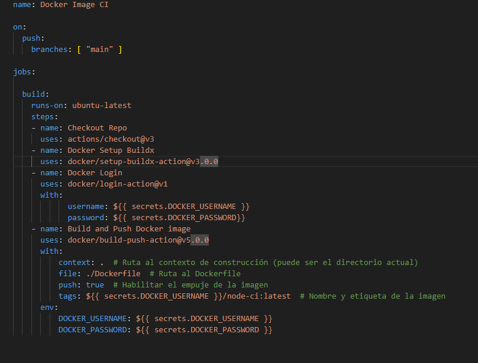

# Steps for CI pipeline

Firts of all I analysed the code to understand its functioning. Then, I created the next dockerfile
 

After that, I created mi yml file for the automation with the instructions given. Working with:
* Secrets
* Docker buildx
 

For the automation, I created the .github/workflow directory
 

Finally, I excecuted the workflow
 